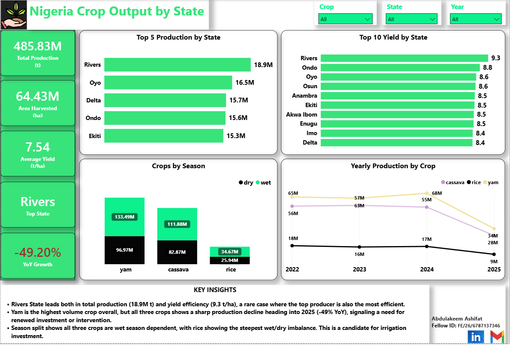

# Nigeria Agricultural Output by State

A Power BI dashboard analyzing yam, cassava, and rice output across Nigerian states, built to support crop output planning decisions.

## Problem statement
Crop output planning needs data. This project analyzes production, yield efficiency, and seasonal patterns for yam, cassava, and rice across Nigerian states.

## Data source
A structured synthetic dataset modeling Nigerian agricultural output patterns (state, LGA, crop, season, area, yield, production), sourced from Hugging Face.

**Note:** This is a synthetic reference dataset, not real government data. It was used specifically to demonstrate the full analytics workflow — cleaning, analysis, and dashboarding.

## Process

### 1. Data cleaning (Excel Power Query)
- Filtered to three target crops: yam, cassava, rice
- Split the season field into separate year and season-type columns
- Aggregated from LGA-level to state-level
- Calculated yield as total production ÷ total area *after* aggregation, avoiding the bias of averaging yield values directly

### 2. Dashboard (Power BI)
Single interactive page featuring:
- KPI cards: total production, area harvested, average yield, top state, year-over-year growth
- Crop, state, and year filters controlling every visual
- Production and yield comparison by state
- Seasonal (wet/dry) production split
- Multi-year production trend by crop

### 3. Key insights
- **Rivers State** leads in both total production (18.9M t) and yield efficiency (9.3 t/ha) — a rare case where the top producer is also the most efficient
- All three crops show a sharp production decline heading into 2025 (-49% YoY)
- All three crops are wet-season dependent, with rice showing the steepest wet/dry imbalance — flagging irrigation as a possible investment lever

## Dashboard preview

## Files in this repo
- `nigeria-agri-output-dashboard.pbix` — Power BI dashboard file
- `cleaned-agricultural-data.xlsx` — cleaned, aggregated dataset
- `dashboard-screenshot.png` — dashboard preview image

## Demo video
[Watch the walkthrough](https://www.loom.com/share/b3a91b4bfa304c6ba09df97b363b0259)

## Tools used
Excel (Power Query), Power BI (DAX, data modeling)

---
Built as a capstone project for the Airtel Nigeria x 3MTT NextGen Data Analytics program.
